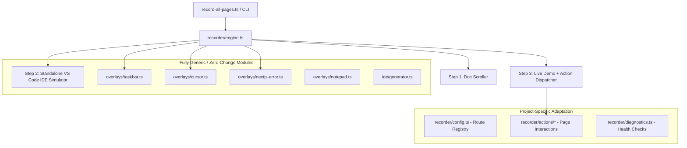

# Autorecording Suite — Project Porting & Integration Guide 🚀

Guide for porting/adapting the **3-step automated recording engine** to any project:

**Official Doc → Standalone VS Code → Live Demo**

Includes interactive Taskbar, human cursor, dynamic AI token-stream detection, Angular signal & zoneless compatibility, file attachment flow, Windows 11 Notepad developer overlays, and service diagnostics.

## Architecture & Decoupling

The suite uses modular, plug-and-play layers:



**Generic/zero-change:** `overlays/taskbar.ts`, `overlays/cursor.ts`, `overlays/nextjs-error.ts`, `overlays/notepad.ts`, `ide/generator.ts`.

**Project-specific:** `recorder/config.ts` (route registry), `recorder/actions/*` (page interactions), `recorder/diagnostics.ts` (health checks).

---

## Step 1 — Verify Dependencies & Environment

Inside `autorecord/package.json`:

```json
{
  "name": "autorecord",
  "version": "1.0.0",
  "private": true,
  "type": "module",
  "scripts": {
    "record": "tsx record-all-pages.ts"
  },
  "dependencies": {
    "playwright": "^1.51.0"
  },
  "devDependencies": {
    "@types/node": "^20",
    "tsx": "^4.19.3",
    "typescript": "^5"
  }
}
```

Install dependencies + Chromium:

```bash
cd autorecord
npm install
npx playwright install chromium
```

---

## Step 2 — 3-Tier Port Configuration

In this Angular + Microsoft Agent Framework harness:
1. **Frontend (Angular 22)**: Port `4200` (`http://localhost:4200`)
2. **Copilot Runtime (Node.js)**: Port `8201` (`http://localhost:8201/api/copilotkit`)
3. **Backend (Python / FastAPI)**: Port `8200` (`http://localhost:8200`)

`autorecord/recorder/diagnostics.ts` verifies all three ports before recording begins.

---

## Step 3 — Route Registry in `recorder/config.ts`

`recorder/config.ts` is the **single source of truth** for recorded pages.

Each `PageRecordConfig` defines:

| Field               | Purpose                                                            |
| ------------------- | ------------------------------------------------------------------ |
| `id`                | Unique CLI ID used by `--page=<id>`                                |
| `name`              | Clean feature title                                                |
| `filename`          | Exported video filename: `MSPY-angular - <NN><FeatureName>`        |
| `docUrl`            | Official documentation URL for Step 1                              |
| `demoUrl`           | Local Step 3 URL, e.g. `http://localhost:4200/quickstart/demo`       |
| `ideFile`           | Source file highlighted in Step 2                                  |
| `startLine`, `endLine` | VS Code highlighted range                                       |
| `prompt`            | Prompt typed in Step 3                                             |
| `waitAfterPromptMs` | Post-stream reading pause (default `4000` ms)                      |

---

## Step 4 — Specialized Action Handlers

Custom action modules in `autorecord/recorder/actions/`:

1. **`attachments.action.ts`**:
   - Glides cursor to the `+` button (`button[aria-label="Add photos or files"]`).
   - Clicks to open the Angular CDK Menu and clicks `Add photos or files`.
   - Injects `sample_chart.png` via `DataTransfer` on `input[type="file"]` and dispatches `change`.
   - Showcases the `<copilot-chat-attachment-queue>` preview thumbnail chip.
   - Re-measures the shifted textarea position, types prompt, dispatches the input signal, and clicks Send.

2. **`voice.action.ts`**:
   - Strictly locates `button[aria-label="Transcribe"]` (microphone button next to Send).
   - Glides cursor and clicks the voice recorder button.
   - Slides up Windows 11 **Notepad** and types the developer note:
     ```text
     NOTE: Voice & Audio Transcription

     - voice works on browser but no tts implemented in the server file thus not working
     ```
   - Closes Notepad and completes recording.

3. **`threads.action.ts`**:
   - Showcases the Headless thread list (`app-thread-list` on `injectThreads`) and `CopilotThreadsDrawer`.
   - Slides up Windows 11 **Notepad** and types the developer note:
     ```text
     NOTE: Threads & Cloud Authentication

     - the project isnt authenticated by the copilotkit cloud via browser as the initial setup wasnt done through copilotkit cli
     ```
   - Closes Notepad and completes recording.

4. **`chat-ui.action.ts`**:
   - Cycles across 4 tabs: Inline Chat (custom scoped styling) → Custom Assistant Message → CopilotPopup → CopilotSidebar.

5. **`tools.action.ts`**:
   - Triggers `getWeather` server tool rendering `WeatherCardComponent` and `change_background` client tool.

6. **`hitl.action.ts`**:
   - Detects `ApprovalCardComponent` decision gate, glides cursor to "Approve" button, and clicks it.

7. **`shared-state.action.ts`**:
   - Clicks "Mark high priority" in `WorkspaceComponent`, verifies reactive agent state context.

8. **`headless-ui.action.ts`**:
   - Types into custom `<textarea>` composer and detects custom `<article data-role="assistant">` transcript.

---

## Step 5 — Active Token-Stream Stability & Response Detection

Do **not** rely on fixed timers or brittle spinner selectors. Use `waitForAgentResponseCompletion(page, 4000)` with text-stability polling.

Behavior:
1. Wait up to **30s** for an assistant message or generative UI component (`app-weather-card`, `app-approval-card`) to begin receiving content.
2. Poll the latest assistant message every **400ms**.
3. Once started, poll every **500ms**, up to **45s**.
4. Compare current vs previous text.
5. **4 consecutive identical checks = 2 seconds of stability = streaming complete.**
6. Log completion with character count.
7. Glide cursor over the completed assistant response or tool card.
8. Pause **4 seconds** for comfortable reading.

---

## Step 6 — Running the Suite

```bash
cd autorecord

# Individual feature test
npm run record -- --page=quickstart
npm run record -- --page=chat-ui
npm run record -- --page=frontend-tools-generative-ui
npm run record -- --page=voice-multimodal
npm run record -- --page=human-in-the-loop
npm run record -- --page=shared-state
npm run record -- --page=threads
npm run record -- --page=attachments
npm run record -- --page=headless

# All registered routes
npm run record
```

Videos are exported to `autorecord/videos/` as **1080p, 60fps WebM** files (`MSPY-angular - <NN><FeatureName>.webm`).
