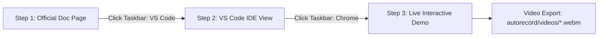
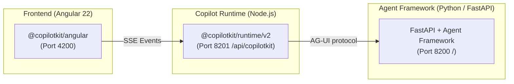

# CopilotKit + Microsoft Agent Framework (Python) Autorecording Suite — Angular 🎬

Automated, high-fidelity Playwright screen-demo/video engine for the **CopilotKit Angular 22 + Microsoft Agent Framework (Python)** integration test harness.

## Contents

- [Overview](#overview)
- [3-Step Video Workflow](#3-step-video-workflow)
- [Architecture & 3-Tier Model](#architecture--3-tier-model)
- [Directory Structure](#directory-structure)
- [Prerequisites & Getting Started](#prerequisites--getting-started)
- [Usage & CLI Reference](#usage--cli-reference)
- [Configured Pages & Route Mapping](#configured-pages--route-mapping)
- [Output Videos](#output-videos)
- [Troubleshooting & Diagnostics](#troubleshooting--diagnostics)

---

## Overview

The **Autorecord Suite** is a Playwright recording pipeline for professional, human-like demos covering official documentation, generative UI components, human-in-the-loop (HITL) decisions, shared agent state, and headless custom transcripts.

### Key capabilities

- **Zero black screen / instant paint:** Uses `domcontentloaded` to start on the rendered docs page without dead frames.
- **Realistic app switching:** Virtual cursor clicks simulated Windows 11 Taskbar icons; active apps receive blue glow bars (`#60a5fa`).
- **Pure VS Code simulation:** Step 2 is isolated HTML/CSS generated from local files, independent of frontend dev servers.
- **Angular 22 reactivity & zoneless readiness:** Waits for Angular component readiness, signal rendering, and DOM stability.
- **Dynamic AI response detection:** Observes chat DOM with text-stability polling across streaming assistant tokens, tool card renderers (`WeatherCardComponent`, `ApprovalCardComponent`), and custom headless transcripts.
- **Pre-flight diagnostics:** Automatically verifies the 3-tier distributed stack:
  - Angular Frontend (`http://localhost:4200`)
  - Node.js Copilot Runtime (`http://localhost:8201/api/copilotkit`)
  - Microsoft Agent Framework FastAPI (`http://localhost:8200`)
- **Human-like motion:** Cubic Bézier cursor paths, Fitts's-law acceleration, typing jitter, and smooth scrolling.

---

## 3-Step Video Workflow



### 1. Official Documentation
- Opens the official CopilotKit Angular docs URL: `https://docs.copilotkit.ai/angular/ms-agent-python/...`
- Moves cursor to reading position, scrolls at human cadence, and hovers over code.
- Moves to `#win11-taskbar-vscode`, clicks VS Code, and activates its blue glow bar (`#60a5fa`).

### 2. VS Code IDE View
- **Step 2a (Quickstart):** Displays `frontend/package.json` highlighting `@copilotkit/angular`, `@copilotkit/runtime`, and `@ag-ui/client`.
- **Step 2b:** Displays the implementation file (e.g. `quickstart-chat.ts`, `tools-chat.component.ts`, `server.ts`) with `startLine`/`endLine` highlighting in VS Code Dark+ (`vs-dark`).
- Cursor moves naturally across the code.
- Cursor moves to `#win11-taskbar-chrome`, clicks Chrome, and activates its blue glow bar.

### 3. Live Interactive Demo
- Opens isolated chrome-free demo endpoint: `http://localhost:4200/<route>/demo`.
- Injects simulated Windows 11 Taskbar with live clock, Start menu, and active-app indicators.
- Executes tailored actions (tab switching, tool triggers, HITL approvals, priority changes, custom headless sends).
- Detects AI token-stream completion and pauses for comfortable reading.

---

## Architecture & 3-Tier Model

Unlike single-backend architectures, this project operates in a **3-tier distributed model**:



---

## Directory Structure

```text
autorecord/
├── record-all-pages.ts        # CLI entrypoint + batch runner + summary
├── README.md                  # Root guide (this file)
├── PORTING_GUIDE.md           # Architecture/porting docs
├── package.json               # Playwright + TSX dependencies
├── tsconfig.json              # TypeScript config
├── videos/                    # Exported WebM videos
│   ├── MSPY-angular-01-Quickstart.webm
│   └── ...
└── recorder/
    ├── README.md              # Recorder architecture
    ├── types.ts               # Interfaces/config schemas
    ├── config.ts              # Route registry + files/line ranges
    ├── engine.ts              # Playwright lifecycle + recording coordinator
    ├── diagnostics.ts         # Health checks + error matcher
    ├── ide/
    │   └── generator.ts       # Pure HTML/CSS VS Code Dark+ simulator
    ├── overlays/
    │   ├── taskbar.ts         # Windows 11 Taskbar + app switching
    │   ├── cursor.ts          # Cursor physics/Bézier easing/typing
    │   └── notepad.ts         # Slide-up Notepad developer-note simulator
    └── actions/
        ├── chat-ui.action.ts       # Inline chat -> Custom message -> Popup -> Sidebar
        ├── tools.action.ts         # WeatherCardComponent + change_background tool
        ├── hitl.action.ts          # HITL ApprovalCardComponent + "Approve" click
        ├── shared-state.action.ts  # Workspace priority toggle + reactive contexts
        ├── headless-ui.action.ts   # Custom headless composer & transcript
        ├── voice.action.ts         # Voice input & multimodal attachments
        ├── threads.action.ts       # Headless thread list & CopilotThreadsDrawer
        ├── memory.action.ts        # Memory list & fallback state
        └── index.ts                # Dispatcher + standard chat fallback
```

---

## Prerequisites & Getting Started

### 1. Microsoft Agent Framework backend (Port 8200)

```bash
cd backend
uv run main.py
```

### 2. Copilot Runtime (Port 8201) & Angular Frontend (Port 4200)

```bash
cd frontend
npm run dev
```

### 3. Autorecord dependencies

```bash
cd autorecord
npm install
npx playwright install chromium
```

---

## Usage & CLI Reference

Record a single feature:

```bash
npm run record -- --page=<id>
```

Available page IDs:

| #   | ID                             | Route                                  |
| --- | ------------------------------ | -------------------------------------- |
| 1   | `quickstart`                   | `/quickstart/demo`                     |
| 2   | `chat-ui`                      | `/chat-ui/demo`                        |
| 3   | `frontend-tools-generative-ui` | `/frontend-tools-generative-ui/demo`   |
| 4   | `a2ui`                         | `/a2ui/demo`                           |
| 5   | `voice-multimodal`             | `/voice-multimodal/demo`               |
| 6   | `human-in-the-loop`            | `/human-in-the-loop/demo`              |
| 7   | `shared-state`                 | `/shared-state/demo`                   |
| 8   | `threads`                      | `/threads/demo`                        |
| 9   | `memory`                       | `/memory/demo`                         |
| 10  | `attachments`                  | `/attachments/demo`                    |
| 11  | `headless`                     | `/headless/demo`                       |
| 12  | `copilot-runtime`              | `/quickstart/demo` (server.ts focus)   |
| 13  | `backend-agent`                | `/quickstart/demo` (main.py focus)     |

Examples:

```bash
npm run record -- --page=quickstart
npm run record -- --page=chat-ui
npm run record -- --page=frontend-tools-generative-ui
npm run record -- --page=human-in-the-loop
npm run record -- --page=shared-state
npm run record -- --page=headless
```

Record **all configured pages sequentially**:

```bash
npm run record
```

---

## Configured Pages & Route Mapping

| ID                             | Video Output                              | Demo Route                             | Highlighted Source File                                   | Lines  |
| ------------------------------ | ----------------------------------------- | -------------------------------------- | --------------------------------------------------------- | ------ |
| `quickstart`                   | `MSPY-angular-01-Quickstart.webm`         | `/quickstart/demo`                     | `frontend/src/app/features/quickstart/quickstart-chat.ts` | 1–16   |
| `chat-ui`                      | `MSPY-angular-02-ChatUi.webm`             | `/chat-ui/demo`                        | `frontend/src/app/features/chat-ui/chat-ui-demo.component.ts` | 28–110 |
| `frontend-tools-generative-ui` | `MSPY-angular-03-FrontendToolsGenUI.webm` | `/frontend-tools-generative-ui/demo`   | `frontend/src/app/features/tools/tools-chat.component.ts` | 22–66  |
| `a2ui`                         | `MSPY-angular-04-A2UI.webm`               | `/a2ui/demo`                           | `frontend/src/app/features/a2ui/a2ui-chat.component.ts`   | 12–25  |
| `voice-multimodal`             | `MSPY-angular-05-VoiceMultimodal.webm`    | `/voice-multimodal/demo`               | `frontend/src/app/features/media/voice-chat.component.ts` | 13–32  |
| `human-in-the-loop`            | `MSPY-angular-06-HumanInTheLoop.webm`     | `/human-in-the-loop/demo`              | `frontend/src/app/features/hitl/approval-card.component.ts` | 18–42  |
| `shared-state`                 | `MSPY-angular-07-SharedState.webm`        | `/shared-state/demo`                   | `frontend/src/app/features/shared-state/workspace.component.ts` | 21–51  |
| `threads`                      | `MSPY-angular-08-Threads.webm`            | `/threads/demo`                        | `frontend/src/app/features/threads/threads-demo.component.ts` | 10–35  |
| `memory`                       | `MSPY-angular-09-Memory.webm`             | `/memory/demo`                         | `frontend/src/app/features/memory/memory-demo.component.ts` | 10–30  |
| `attachments`                  | `MSPY-angular-10-Attachments.webm`        | `/attachments/demo`                    | `frontend/src/app/features/attachments/media-chat.component.ts` | 8–28   |
| `headless`                     | `MSPY-angular-11-HeadlessUI.webm`         | `/headless/demo`                       | `frontend/src/app/features/headless/headless-chat.component.ts` | 12–66  |
| `copilot-runtime`              | `MSPY-angular-12-CopilotRuntime.webm`     | `/quickstart/demo`                     | `frontend/server.ts`                                      | 24–61  |
| `backend-agent`                | `MSPY-angular-13-BackendAgent.webm`       | `/quickstart/demo`                     | `backend/main.py`                                         | 74–111 |

---

## Output Videos

- **Directory:** `autorecord/videos/`
- **Resolution:** 1920 × 1080 (1080p Full HD)
- **Framerate:** 60 FPS
- **Container:** WebM
- **Naming format:** `MSPY-angular-<FeatureName>.webm`

---

## Troubleshooting & Diagnostics

### 1. Python Backend unreachable (Port 8200)
- **Error:** `Microsoft Agent Framework Backend (port 8200) is unreachable`
- **Fix:**
  ```bash
  cd backend
  uv run main.py
  ```

### 2. Copilot Runtime unreachable (Port 8201)
- **Error:** `Copilot Runtime Node.js (port 8201) is unreachable`
- **Fix:**
  ```bash
  cd frontend
  npm run runtime
  ```

### 3. Angular Frontend unreachable (Port 4200)
- **Error:** `Angular Frontend (port 4200) is unreachable`
- **Fix:**
  ```bash
  cd frontend
  npm start
  ```
  *(Or run `npm run dev` in `frontend/` to launch runtime and Angular concurrently)*
