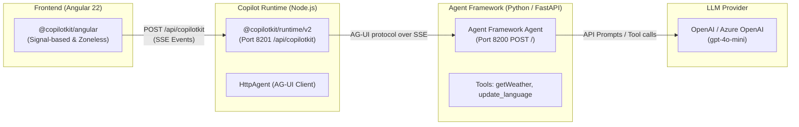

### Project Overview

This project is an **interactive test harness and demonstration suite** for validating the integration between **CopilotKit** (Angular client + Node runtime) and the **Microsoft Agent Framework** (Python / FastAPI).

The repository serves two main purposes:

1. **Interactive Demo & QA Harness**: A running Angular 22 web application that implements and tests every feature of `@copilotkit/angular` against a live Python-based Microsoft Agent Framework backend.
2. **Living Documentation Verifier**: Mirrors the official documentation found in [2-docs/](file:///c:/Users/dynamic%20computer/Desktop/work/FIQROS/optimized-malaika/mspy-angular/2-docs), ensuring that code snippets shown in docs are byte-identical to actual executing code.

---

### Architecture Overview

Unlike traditional single-backend architectures, this project uses a **3-tier distributed model**:



1. **Frontend (Browser - Angular 22)**:
   - Configured in [app.config.ts](file:///c:/Users/dynamic%20computer/Desktop/work/FIQROS/optimized-malaika/mspy-angular/frontend/src/app/app.config.ts) using `provideCopilotKit({ runtimeUrl: 'http://localhost:8201/api/copilotkit' })`.
   - Never exposes OpenAI keys directly to the browser.
   - Built with modern Angular conventions: signal-based reactivity, standalone components, native control flow (`@if`, `@for`), and Tailwind CSS v4.

2. **Copilot Runtime Proxy ([frontend/server.ts](file:///c:/Users/dynamic%20computer/Desktop/work/FIQROS/optimized-malaika/mspy-angular/frontend/server.ts))**:
   - Runs on **port 8201** as a standalone Node.js server using `@copilotkit/runtime/v2`.
   - Registers two agent aliases (`default` and `support`) pointing to the Python agent at `http://localhost:8200/` via `@ag-ui/client`'s `HttpAgent`.
   - Enables `a2ui: {}` middleware across all registered agents.

3. **Backend Agent ([backend/main.py](file:///c:/Users/dynamic%20computer/Desktop/work/FIQROS/optimized-malaika/mspy-angular/backend/main.py))**:
   - Runs on **port 8200** via FastAPI and Uvicorn.
   - Powered by `agent-framework-ag-ui` and `agent-framework-openai`.
   - Exposes tools like `getWeather` and `update_language` alongside two-way state schema definitions (`STATE_SCHEMA`, `PREDICT_STATE_CONFIG`).

---

### Directory Structure

```
mspy-angular/
├── project-context.md          # Rules & ground truth for doc-project parity
├── 2-docs/                     # Markdown source documentation
│   ├── 1-quickstart.md
│   ├── 2-chat-ui.md
│   ├── 3-frontend-tools-generative-ui.md
│   ├── 4-a2-ui.md
│   ├── 5-voice
│   ├── 6-human-in-the-loop.md
│   ├── 7-shared-state.md
│   └── threads-memory-attachments-headless.md
├── backend/                    # Python / Microsoft Agent Framework
│   ├── pyproject.toml          # uv-managed dependencies (FastAPI, agent-framework)
│   ├── uv.lock
│   └── main.py                 # FastAPI app, agent tools, AG-UI endpoint
└── frontend/                   # Angular 22 Application + Node Runtime
    ├── package.json            # npm scripts & dependencies
    ├── server.ts               # Copilot Runtime server (Node.js, Port 8201)
    ├── scripts/
    │   └── generate-sources.ts # Syncs running source code into TypeScript strings
    └── src/
        ├── styles.css          # Tailwind 4, CopilotKit CSS, and theme tokens
        └── app/
            ├── app.config.ts   # Root providers (provideCopilotKit, sandbox functions)
            ├── app.routes.ts   # Doc routes + isolated chrome-free /demo routes
            ├── components/     # App layout, health check, UI primitives
            ├── features/       # 11 isolated feature modules
            ├── lib/            # Nav configuration & source code loader
            └── pages/          # 14 routed doc & overview pages
```

---

### Feature Modules & Implementation Status

The project defines each feature area in [nav-config.ts](file:///c:/Users/dynamic%20computer/Desktop/work/FIQROS/optimized-malaika/mspy-angular/frontend/src/app/lib/nav-config.ts) and displays status in [status.ts](file:///c:/Users/dynamic%20computer/Desktop/work/FIQROS/optimized-malaika/mspy-angular/frontend/src/app/pages/status.ts):

| Feature Area                 | Route & Demo                                                                                                                                                                                                                                                             | Description                                                                                                                                | Implementation Status                                |
| :--------------------------- | :----------------------------------------------------------------------------------------------------------------------------------------------------------------------------------------------------------------------------------------------------------------------- | :----------------------------------------------------------------------------------------------------------------------------------------- | :--------------------------------------------------- |
| **Quickstart**               | [/quickstart](file:///c:/Users/dynamic%20computer/Desktop/work/FIQROS/optimized-malaika/mspy-angular/frontend/src/app/pages/quickstart.ts)                                                                                                                               | Baseline chat integration with `provideCopilotKit` and `<copilot-chat />`                                                                  | `Working`                                            |
| **Chat UI & Theming**        | [/chat-ui](file:///c:/Users/dynamic%20computer/Desktop/work/FIQROS/optimized-malaika/mspy-angular/frontend/src/app/pages/chat-ui.ts)                                                                                                                                     | Embedded, sidebar (`CopilotSidebar`), and popup (`CopilotPopup`) surfaces + custom message components                                      | `Working`                                            |
| **Frontend Tools & Gen UI**  | [/frontend-tools-generative-ui](file:///c:/Users/dynamic%20computer/Desktop/work/FIQROS/optimized-malaika/mspy-angular/frontend/src/app/pages/frontend-tools-generative-ui.ts)                                                                                           | Server-side tools rendered in Angular (`WeatherCardComponent`), browser-side tools (`change_background`), and sandboxed Open Generative UI | `Working`                                            |
| **Human-In-The-Loop (HITL)** | [/human-in-the-loop](file:///c:/Users/dynamic%20computer/Desktop/work/FIQROS/optimized-malaika/mspy-angular/frontend/src/app/pages/human-in-the-loop.ts)                                                                                                                 | User confirmation dialogs (`registerHumanInTheLoop`, `ApprovalCardComponent`) and interrupt panels                                         | `Working`                                            |
| **Shared State & Context**   | [/shared-state](file:///c:/Users/dynamic%20computer/Desktop/work/FIQROS/optimized-malaika/mspy-angular/frontend/src/app/pages/shared-state.ts)                                                                                                                           | Synchronized state (`injectAgentStore`) and contextual metadata injection (`AccountContextComponent`, `SelectionContextComponent`)         | `Working`                                            |
| **Attachments**              | [/attachments](file:///c:/Users/dynamic%20computer/Desktop/work/FIQROS/optimized-malaika/mspy-angular/frontend/src/app/pages/attachments.ts)                                                                                                                             | File picker, drag-and-drop, and clipboard image pasting via `AttachmentsConfig`                                                            | `Working`                                            |
| **Headless UI**              | [/headless](file:///c:/Users/dynamic%20computer/Desktop/work/FIQROS/optimized-malaika/mspy-angular/frontend/src/app/pages/headless.ts)                                                                                                                                   | Custom transcript and message composer built entirely from scratch using `injectAgentStore` & `runAgent`                                   | `Working`                                            |
| **A2UI (Adaptive UI)**       | [/a2ui](file:///c:/Users/dynamic%20computer/Desktop/work/FIQROS/optimized-malaika/mspy-angular/frontend/src/app/pages/a2ui.ts)                                                                                                                                           | Declarative UI driven by runtime A2UI middleware; recovery timers and styling                                                              | `Partial` (Awaiting catalog definition)              |
| **Voice & Multimodal**       | [/voice-multimodal](file:///c:/Users/dynamic%20computer/Desktop/work/FIQROS/optimized-malaika/mspy-angular/frontend/src/app/pages/voice-multimodal.ts)                                                                                                                   | Voice recording controls and multimodal payload generation                                                                                 | `Partial` (No cloud transcription service wired)     |
| **Threads & Memory**         | [/threads](file:///c:/Users/dynamic%20computer/Desktop/work/FIQROS/optimized-malaika/mspy-angular/frontend/src/app/pages/threads.ts), [/memory](file:///c:/Users/dynamic%20computer/Desktop/work/FIQROS/optimized-malaika/mspy-angular/frontend/src/app/pages/memory.ts) | Multi-turn thread management and persistent agent memories                                                                                 | `Partial` (Requires Enterprise Intelligence license) |

---

### Key Architectural Highlights

1. **Dual Routing Structure (Doc vs Demo)**:
   - Every feature has a documentation view (`/feature`) that explains the concept, provides manual pass/fail test instructions, and renders syntax-highlighted source code.
   - Every feature also has a chrome-free demo view (`/feature/demo`), isolated from sidebars and headers so it can be tested or screen-recorded cleanly.
2. **Byte-Identical Code Embedding**:
   - The script [scripts/generate-sources.ts](file:///c:/Users/dynamic%20computer/Desktop/work/FIQROS/optimized-malaika/mspy-angular/frontend/scripts/generate-sources.ts) runs at `prestart` and `prebuild` time.
   - It reads actual `.ts`, `.html`, and `.css` files from disk and compiles them into a source map in `generated-sources.ts`. What the documentation UI renders is guaranteed to be the exact code being executed.
3. **Real-time Backend Health Monitoring**:
   - [backend-health.ts](file:///c:/Users/dynamic%20computer/Desktop/work/FIQROS/optimized-malaika/mspy-angular/frontend/src/app/components/backend-health.ts) continuously verifies connectivity to both the Copilot Runtime (`http://localhost:8201/api/copilotkit/info`) and the Python Agent Framework (`http://localhost:8200/openapi.json`).

---

### How to Run the Project

#### 1. Backend (Python Agent Framework)

```bash
cd backend
# Requires Python 3.13+ and uv (or virtualenv)
uv sync
uv run main.py
# Runs on http://localhost:8200
```

_Note: Ensure either `OPENAI_API_KEY` or `AZURE_OPENAI_ENDPOINT` + `AZURE_OPENAI_API_KEY` are configured in `.env`._

#### 2. Copilot Runtime & Angular Frontend

```bash
cd frontend
npm install

# Option A: Run runtime and frontend concurrently
npm run dev

# Option B: Run separately
npm run runtime    # Starts Copilot Runtime on http://localhost:8201
npm start          # Starts Angular Dev Server on http://localhost:4200
```

#### 3. Automated Screen Recording & Demonstration Suite

Once the backend (`8200`), runtime (`8201`), and frontend dev server (`4200`) are running:

```bash
cd frontend

# Record all 11 pages in sequence
npm run record

# Record a specific page individually
npm run record -- --page=quickstart
npm run record -- --page=chat-ui
npm run record -- --page=frontend-tools-generative-ui
npm run record -- --page=a2ui
npm run record -- --page=voice-multimodal
npm run record -- --page=human-in-the-loop
npm run record -- --page=shared-state
npm run record -- --page=threads
npm run record -- --page=memory
npm run record -- --page=attachments
npm run record -- --page=headless
```

Recordings are saved to `frontend/recordings/<page_id>.webm`.
